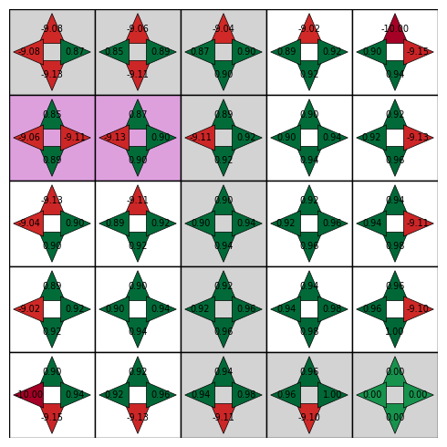

# 1. Q-learning: How Does It Work?

If you want to deeply understand how Q-learning works, you are at the right place: there is nothing better than getting hands-on to learn.
But before, I advise you to watch my video explaining how q learning works at : 

And my implementation of the q learning algorithm using python at :

You will find 2 folders here:
- `video_code, which code is explained in the implementation video above.`
- `advanced_code, which is an evolution of this code with more features explained below`
There are two important files:
- `Env.py`
- `Trainer.py`

## Env.py

The `Env` class is defined in this file. It describes the environment in which the agent will evolve.

```python
from Env import Env

env = Env(n=5, p=5, borders=True, holes=True, final_state=[5,5], L_holes=[[1, 1]])
state = env.reset() # returns [0,0]
action = 1 # go down (will be deterined by the agent: )
next_state, reward, terminated = env.step(1)
print(next_state) #output : [1,0]
```

### Main Functions in Env and Trainer Classes

#### Env class (in `Env.py`):

- `reset`: Resets the environment to the initial state and returns it.

- `step(action)`: Takes an action, updates the state, and returns the next state, reward, and whether the episode is terminated.

- `render`: (If present) Visualizes or prints the current state of the environment.

- `reward_grid` (attribute): The grid showing rewards for each tuple (state,action) such that r(s,a) = reward_grid[state[0],state[1],action].


## Agent.py

The `Agent` class handles the training, based on epsilon greedy policy and the Bellmann equation.

```python
from Agent import Agent

agent = Agent(5, 5, borders=True, holes=True, final_state=[5,5], L_holes=[[1, 1]])
agent.train(10000, show_table=False, show_graphs=True)
```

#### Agent class (in `Agent.py`):

- `train(episodes, show_table, show_graphs)`: Runs the Q-learning algorithm for a number of episodes, with options to display results.
Be careful, show_table will display the q_table in the terminal, but in order to visualize it, as training is very fast, i added some delay: so this will slow the process.

- `choose_action(state)`: Selects an action based on the current policy (e.g., epsilon-greedy).

- `update_q_table(state, action, reward, next_state)`: Updates the Q-table using the Bellmann equation.

- `play_one_step()`: Execute a complete path of the agent from starting point to finish line.

- `best_path(list: bool)`:  Retrieves the best path found by the agent (if list == True, it will return the list of the states visited by the agent, otherwise, the path in the grid).

## How to Run

1. Make sure you have the required dependencies:
  - `numpy` 
  - `matplotlib`

2. Clone the repo:
  ```bash
  git clone https://github.com/SamS709/reinforcement_learning_series.git rl_scripts
  ```
3. Run the training script:
  ```bash
  cd rl_scripts
  python 1/Trainer.py
  ```


## Visualization

The Q-table is visualized after training using a custom plotting function. Positive Q-values are shown in green, negative in red, and each action is represented by an arrow in each state. If you placed holes, they are shown in purple, and the final best path found by the agent is grey.

### Example Q-table Visualization


