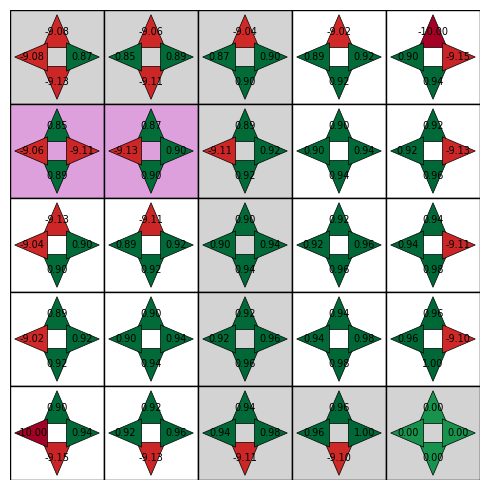

# 1. Q-learning: How Does It Work?

If you want to deeply understand how Q-learning works, you are at the right place: there is nothing better than getting hands-on to learn.

There are two important files:
- `Env.py`
- `Trainer.py`

## Env.py

The `Env` class is defined in this file. It describes the environment in which the agent will evolve.

```python
from Env import Env

env = Env(n=5, p=5, borders=True, holes=True, final_state=None, L_holes=[[1, 1]])
print(env.reward_grid)
state = env.reset()
next_state, reward, terminated = env.step(1)
```

## Trainer.py

The `Trainer` class handles the Q-learning algorithm, training, and policy.

```python
from Trainer import Trainer

trainer = Trainer(5, 5, borders=True, holes=True, final_state=None, L_holes=[[1, 1]])
trainer.train(10000, show_final_path=True, show_table=False, show_graphs=True)
```

## How to Run

1. Make sure you have the required dependencies:
  - `numpy` 
  - `matplotlib`

2. Clone the repo:
  ```bash
  git clone https://github.com/SamS709/reinforcement_learning_series.git rl_scripts
  ```
3. Run the training script:
  ```bash
  cd rl_scripts
  python 1/Trainer.py
  ```


## Visualization

The Q-table is visualized after training using a custom plotting function. Positive Q-values are shown in green, negative in red, and each action is represented by an arrow in each state. If you placed holes, they are shown in purple, and the final best path found by the agent is grey.

### Example Q-table Visualization


